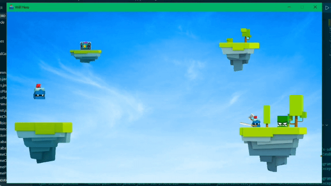
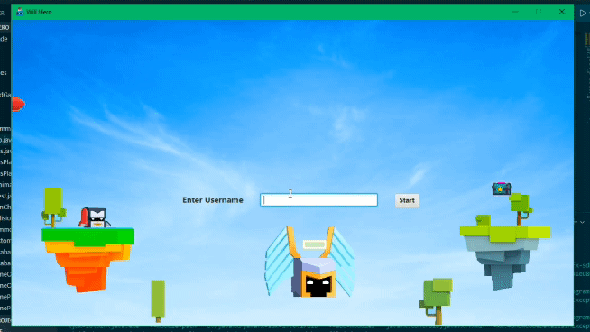
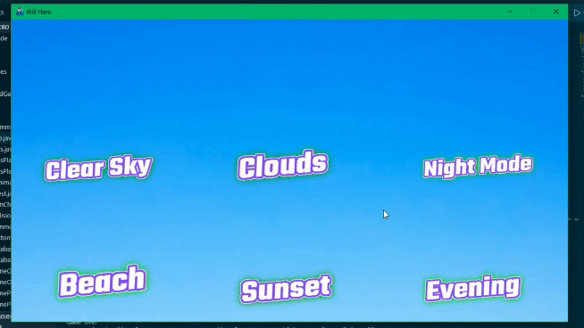
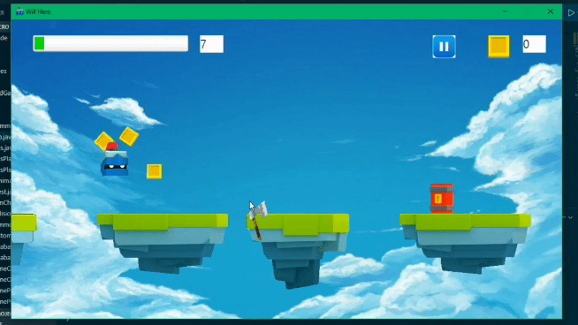
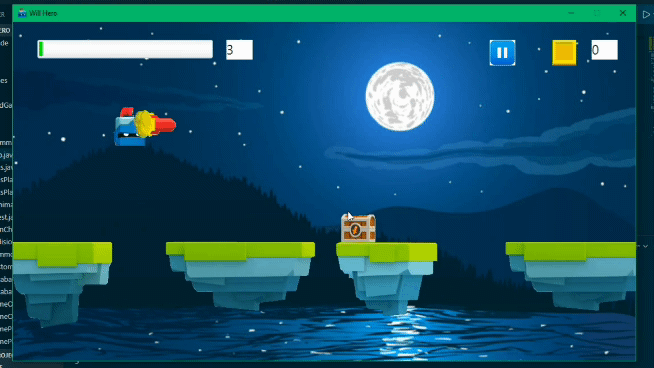
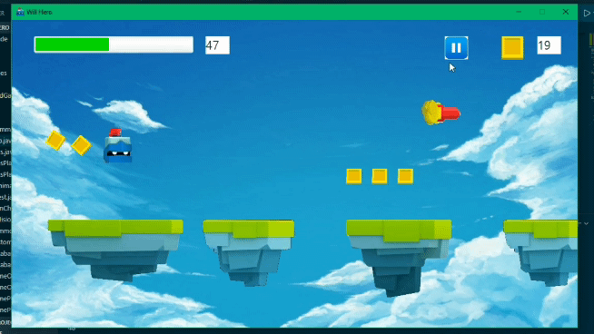
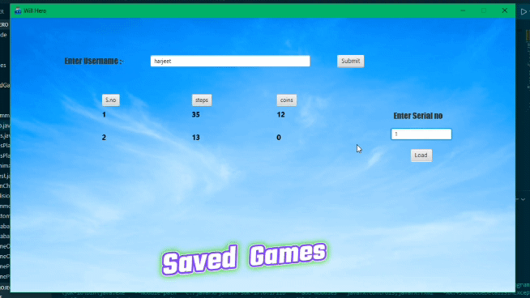

# Will-Hero Game

This is replica of Will Hero mobile Game, implemented using 
Java, JavaFX, CSS

## Implementation Details:-
- The UI/UX of the game has been designed using JavaFX
- Utilised CSS styling for the game background
- Utilised Animation Timer, Traslation and Timeline classes from java libarary for adding cool animations
- Utilised Serializable interface, and Serializaion/deserialization concepts for saving and loading the games 
- Heavy usage of java event Handling classes to handle mouse and keyboard input

## Game Objecive:-
- The primary aim of Will Hero is to keep moving and survive. Keep clicking to dash sideways
- You have to dash over floating islands and dodge monsters along the way. Timing is crucial for survival.
- As you progress through the level, you'll encounter monsters
- You'll be collecting weapons and coins as you go along. You can use weapons to kill the monsters and increase your score.

## Dependencies
- JDK 16 or higher | [Download](https://www.oracle.com/in/java/technologies/javase-jdk15-downloads.html)

- JavaFX-sdk-17.0.1 or higher | [Download](https://gluonhq.com/products/javafx/)

- Git | [Download](https://git-scm.com/downloads)

## In-Game Snapshots

### Welcome/Username

### Chose Theme

### Game Play

### Dark Theme

### Save/Resume

### Resurrection

### Loading Saved Games

## Author
**Harjeet Singh Yadav** 
-[Github](https://github.com/harjeet-blue)
